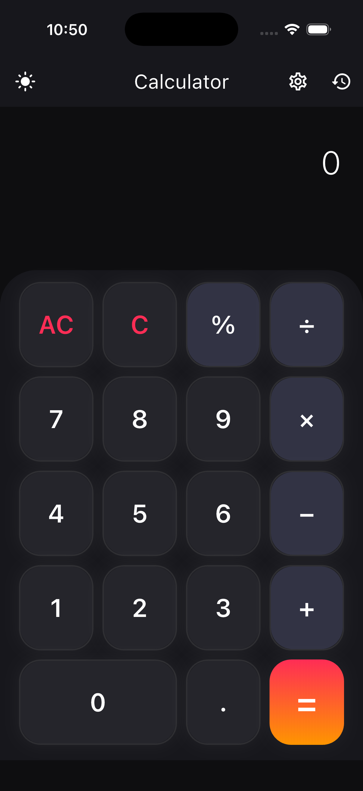
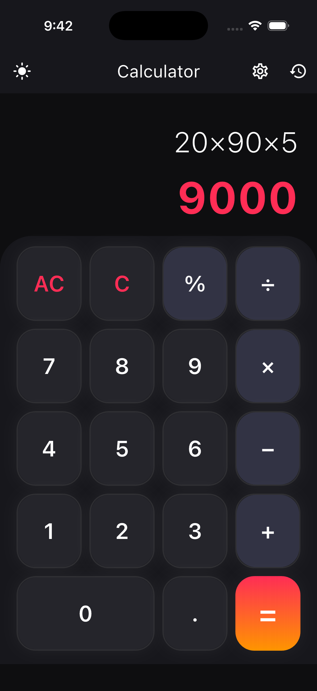
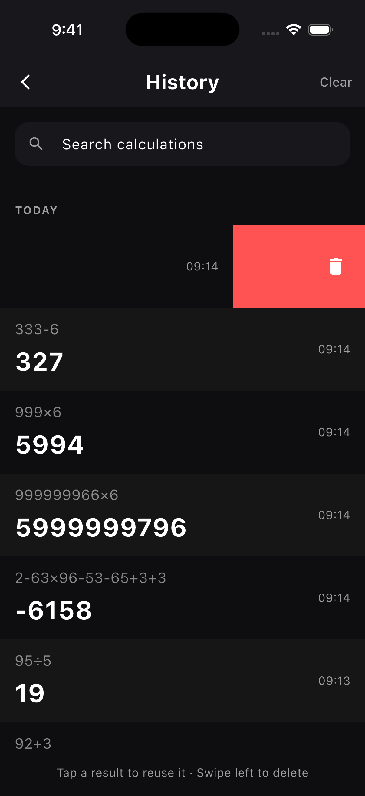
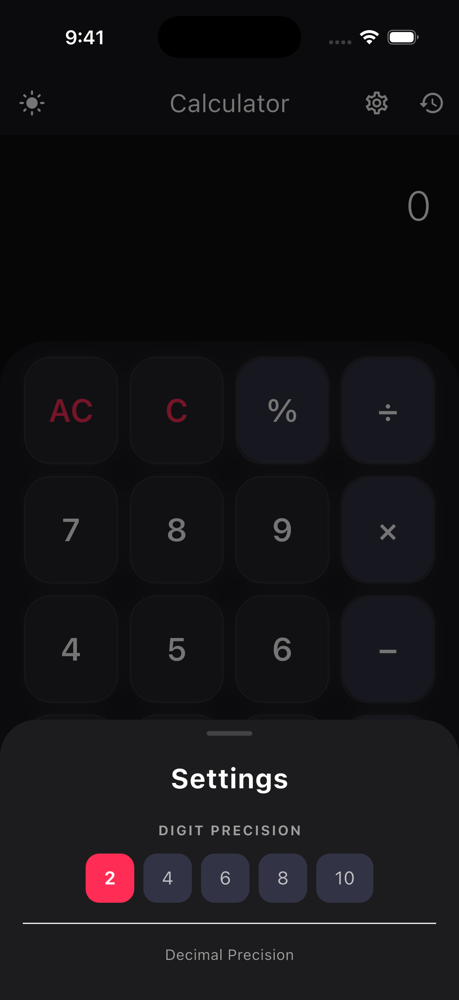
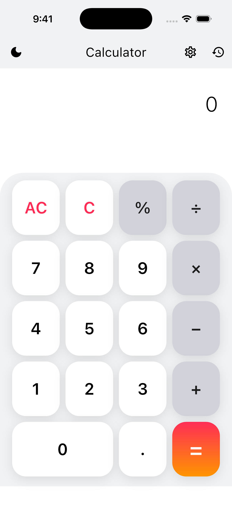
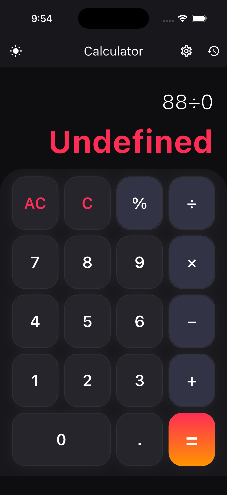

# Calculator

A Flutter calculator submitted as part of the interview process. The feature scope is intentionally small arithmetic, history, theming, precision settings so the focus is on how the code is structured, the decisions behind the stack, and the quality of the presentation layer.

## Screenshots

<table border="0">
  <tr>
    <td><br/><sub><b>Main Page (Dark)</b></sub></td>
    <td><br/><sub><b>Calculation (Dark)</b></sub></td>
    <td><br/><sub><b>History (Dark)</b></sub></td>
  </tr>
  <tr>
    <td><br/><sub><b>Settings (Dark)</b></sub></td>
    <td><br/><sub><b>Main Page (Light)</b></sub></td>
    <td><br/><sub><b>Error Handling</b></sub></td>
  </tr>
</table>

## What it does

- Standard arithmetic: `+`, `−`, `×`, `÷`, `%`
- Calculation history — stored locally, searchable, tap an entry to pull the result back into the current expression
- Light and dark themes with a toggle in the app bar
- Settings for decimal precision (2, 4, 6, 8, or 10 places)
- Handles divide-by-zero and malformed expressions without crashing

## Stack

- **Flutter** with **GetX** for state management and dependency injection
- **math_expressions** for parsing and evaluating expressions
- **GetStorage** for persisting history and settings locally

## Approach

The feature set is small enough that a flatter structure would work. I used a feature-first layout, a dedicated service layer, and DI anyway, they're the patterns I'd reach for on a production codebase, and keeping them here means the architecture translates directly as the product grows. Boundaries stay clear, PRs stay narrow, and new contributors have one obvious place to look for any given concern.

GetX was chosen because reactive state, DI, and routing come from a single dependency. For a team, that means less stack to explain, lower onboarding cost, and one mental model instead of three.

## Project structure

```
lib/
├── core/
│   ├── bindings/       # DI setup
│   ├── services/       # GetStorage wrapper
│   └── theme/          # Colors, text styles, app theme
├── features/
│   └── calculator/
│       ├── controllers/
│       ├── models/
│       └── views/
│           └── widgets/
└── main.dart
```

Shared concerns live in `core/`. Feature code stays self-contained under `features/`, so adding a second feature later is a matter of creating a sibling folder, not refactoring the existing one.

## Running it

```bash
flutter pub get
flutter run
```

Release build:

```bash
flutter build apk --release
```
